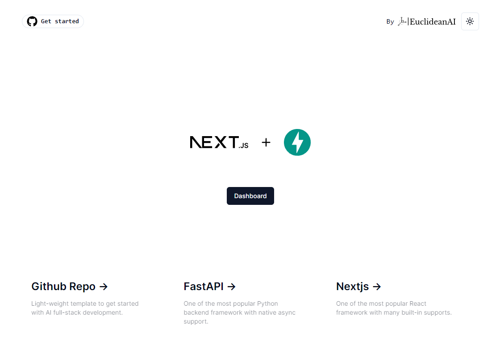
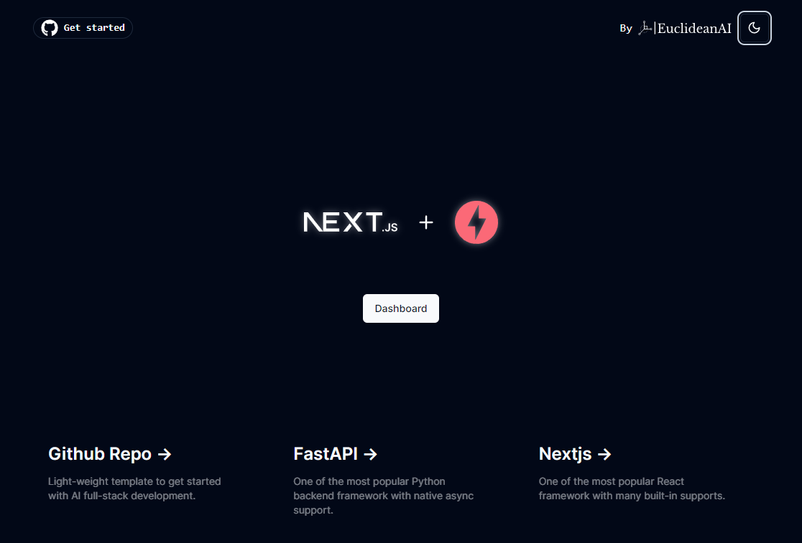
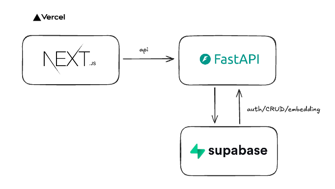

# AI Engineer Template Nextjs + FastAPI 🚀




### Demo website 🌐

https://ai-engineer-template.vercel.app

### Tech stack 🛠️

The backend code in this repository originated from the [FastAPI full stack template](https://github.com/fastapi/full-stack-fastapi-template) plus additional AI components that make this AI engineer template unique.

To fast-track MVP building process, which is crucial for most AI products, we have chosen a simple tech stack. This allows people to focus more on iterating through product features rather than on DevOps from the outset.



### How to run in local 🏃‍♂️

Refer to [development](development.md)

### Openapi Fetch

[](https://openapi-ts.pages.dev/openapi-fetch/ "Openapi-fetch")

Since Nextjs offers caching out-of-box (more caching details refer to [Nextjs caching](http://https://nextjs.org/docs/app/building-your-application/caching "Nextjs caching")), we don't have to use React Query, which is an awesome library to manage client side API requests but it has a little bit learning curve for beginners. Rather, the API requests can just be made via fetch (Nextjs added some improvement on the original javascript fetch function). We chose a very light-weight OpenAPI client library just to read the openapi specification file (saved as 'openapi.json') and make sure we have consistent and clearn code.

Here is an example.
First, in '/frontend/lib/api/index.ts' we initiate the API client.

```javascript
import createClient from "openapi-fetch";
import type { paths } from "./v1";
import { cookies } from "next/headers";

const client =
  createClient <
  paths >
  {
    baseUrl: process.env.API_BASE_URL,
    headers: {
      Authorization: `Bearer ${cookies().get("access_token")?.value}`,
    },
  };
export default client;
```

then, on a server component, we can just do

```javascript
import client from "@/lib/api";
async function getItems() {
  const { data, error } = await client.GET("/api/v1/items/", {
    cache: "no-store",
  });
  if (error) {
    console.log(error);
    // any other error handling code
  }
  return data;
}
```

This is is a very simple and clean way, in my personal opinion, to handle frontend API requests.

### UI library

We use [Shadcn](https://ui.shadcn.com/ "Shadcn"). It's light-weight, all the UI components are imported as plain javascript code for transparency. So, you can modify to suit your need.

### Deployment

This is a 100% serverless template! No need to manage a VM or Kubernates yourself. And it will be completely free to start with. Frontend, backend and database code is deployed to three serverless hosting separately with individual scalability.<br>
Frontend --> Vercel<br>
Backend --> GCP Cloud Run<br>
Database --> Supabase (Postgres)<br>
**You don't need to clickOps the deployment. The whole deployment process is set up via github actions. Whenever there is a merge to the main branch, a CD will be triggered.**

Refer to the guide [here](deployment.md)

### EuclideanAI

Who the hell is EuclideanAI? we are a boutique Data&AI consultancy who provide purpose-built AI, data, machine learning solutions for our clients. [Feel free to reach out!](https://euclideanai.com/contactus/)

### License

The AI Engineer Template is licensed under the terms of the MIT license.
